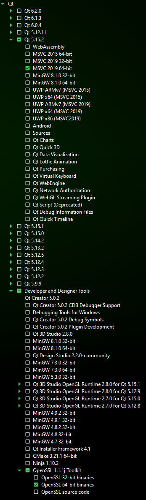
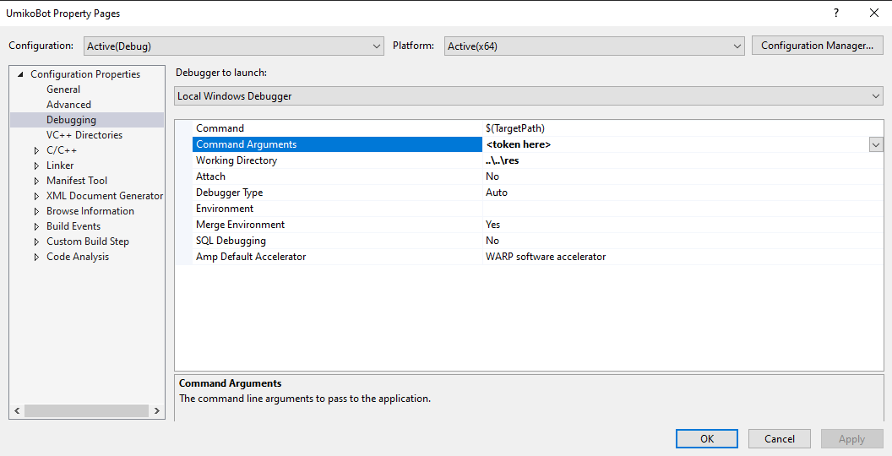

# UmikoBot

Umiko is the bot used on [TheCherno's Discord Server](https://discord.gg/K9rMPsu9pQ). This repository is what makes Umiko; it's the source code and it is completely open source!

## ❓ What can it do?

Umiko can do everything that a Discord bot can technically do. Of course it doesn't do all of it, but if you feel like there's something missing that would make Umiko better, contributions are always welcomed!

## 🙋‍♂️ Contributing

So you want to contribute? Awesome! Let's get you going. For starters, know that Umiko uses **[QDiscord](https://github.com/Gaztin/QDiscord)** to interface with the Discord API. This is already in the repo as a submodule, so you don't need to worry much.

There are some prerequisites to the whole setup and build process after you're done forking and cloning, so let's start with those:

### Prerequisites

#### Windows

- Windows 10
- **[Qt](https://www.qt.io/) (version 5)**
- Visual Studio (recommended)



#### Linux (or WSL on Windows)

To build on linux, you first need to make sure you have `g++` and `make` ready to go. Then all you need to do to install Qt is

```bash
sudo apt install qt5-default libqt5websockets5-dev
```

### Setting up the project

All you need to do to set up the project is to run:

#### Windows

```bat
scripts\init.bat
scripts\generate_project_files.bat
```

#### Linux

```bash
scripts/init.sh
scripts/generate_project_files.sh
```

#### `init.sh`

This file makes temporary folders and files to facilitate the setup. It makes sure you can run `premake5` (it downloads it if it doesn't find `premake5` globally) and ensures that you have recursively cloned the project (by updating the submodules).

#### `generate_project_files.sh`

As the name suggests, this scripts generates the necessary files by using Premake. **You should run this whenever you add or remove source files.**

You can provide an action of your choice for Premake, or allow the script to select defaults:

- Visual Studio 2019 on Windows
- `qmake` on Linux

### Building and Running

When running, the authorisation token for the bot is provided as a command line argument.

#### Windows

Open the solution (found in the `sln\` directory) in Visual Studio. To add the bot token as a command line argument, go to Project Properties -> Debugging.



#### Linux

```bash
cd sln/
qmake UmikoBot.pro
make

cd ../res/
../bin/UmikoBot <token>
```

## ❓ Help and FAQ

If you weren't able to properly carry out the setup process, or if you just want to know more Umiko in general, considering checking these questions before opening an issue:

<details>
<summary>Is Umiko going to be open for invites anytime soon?</summary>
This hasn't been thought about much, but all of Umiko is developed keeping multiple servers in mind, so we're ready for that already!
</details>

<details>
<summary>Is there some kind of a Roadmap?
</summary>

The closest thing to that we currently have is [this](https://github.com/TheChernoCommunity/UmikoBot/projects/1).
</details>

<details>
<summary>Is there some kind of a community where I can interact with fellow contributors?
</summary>

Glad you asked! We'll be happy to see you on our [Discord Server!](https://discord.gg/zrUpn7RG5k)
</details>
